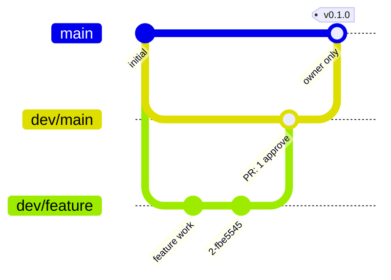

# Contributing to bffi-rs

[English](https://github.com/z2net/bffi-rs/blob/main/docs/CONTRIBUTING.md) | [Русский](https://github.com/z2net/bffi-rs/blob/main/docs/i18n/ru/CONTRIBUTING.md) | [简体中文](https://github.com/z2net/bffi-rs/blob/main/docs/i18n/zh-CN/CONTRIBUTING.md)

Thank you for your interest in contributing.

Repository: https://github.com/z2net/bffi-rs
Contact: contact@z2net.com

Please also read:

- [DESIGN.md](https://github.com/z2net/bffi-rs/blob/main/docs/DESIGN.md) - architecture and decisions
- [AGENTS.md](https://github.com/z2net/bffi-rs/blob/main/AGENTS.md) - rules for humans and AI agents
- [CODE_OF_CONDUCT.md](https://github.com/z2net/bffi-rs/blob/main/docs/CODE_OF_CONDUCT.md)

---

## Development setup

### Requirements

- **Rust / Cargo 1.98.0** (pinned)
- **Bun >= 1.4.0**
- Git

```bash
# Install / select Rust toolchain
rustup toolchain install 1.98.0
rustup default 1.98.0

# Clone
git clone https://github.com/z2net/bffi-rs.git
cd bffi-rs

# JS tooling
bun install
```

### Useful commands

```bash
bun run lint          # oxlint
bun run typecheck     # TypeScript check
bun run build         # builds the reference cdylib (release)
bun run test:js       # runs the package unit tests (bun test packages)
bun run ci            # full CI parity: lint, typecheck, fmt, clippy, tests, JS tests
cargo fmt
cargo clippy
cargo check
cargo test
```

---

## Commit message convention

We follow [Conventional Commits](https://www.conventionalcommits.org/).

Format:

```
<type>(optional scope): <short description>

[optional body]

[optional footer]
```

### Allowed types

| Type       | Meaning                                  |
| ---------- | ---------------------------------------- |
| `feat`     | New feature                              |
| `fix`      | Bug fix                                  |
| `docs`     | Documentation only                       |
| `style`    | Formatting, no logic change              |
| `refactor` | Code change that is not a fix or feature |
| `perf`     | Performance improvement                  |
| `test`     | Adding or fixing tests                   |
| `build`    | Build system or dependencies             |
| `ci`       | CI configuration                         |
| `chore`    | Maintenance tasks                        |
| `revert`   | Revert a previous commit                 |

### Examples

```
feat(core): implement generational handle table
fix(types): correctly copy UTF-8 strings across FFI
docs: clarify zero-copy policy in DESIGN.md
refactor(macros): simplify #[bffi] expansion
chore: pin rust-toolchain to 1.98.0
```

Breaking changes:

```
feat(api)!: rename Handle to BffiHandle

BREAKING CHANGE: the public type `Handle` was renamed to `BffiHandle`.
```

---

## Branching and releases

### Branch model

| Branch          | Purpose                                                         |
| --------------- | --------------------------------------------------------------- |
| `main`          | Production branch. Stable, release-ready code only.             |
| `dev/main`      | Integration branch. All feature work lands here through PRs.    |
| `dev/<feature>` | Feature branches (`dev/ffi-handles`, `dev/error-mapping`, ...). |

- PRs into `main` are created **only by the project owner**, from `dev/main`.
- All development happens in `dev/<feature>` branches, cut from `dev/main`, merged back into `dev/main`.
- Branch names are kebab-case: `dev/ffi-handles`, `dev/fix-panic-mapping`.



### Review rules

- PR `dev/<feature>` → `dev/main`: at least **1 approval** (owner or maintainer) and green CI (the `ci.yml` GitHub Actions workflow; `bun run ci` locally).
- PR `dev/main` → `main`: owner only, on a release merge (see tags below).
- Reviews follow the PR template checklist (fmt, clippy, tests, lint, docs).

### Tags

- Tags are `v<semver>` (e.g. `v0.1.0`) and are created **only on `main`**, only by the owner.
- Tags are **annotated** (`git tag -a v0.1.0 -m "..."`) and point at the merge commit of `dev/main` → `main`.
- The version in `Cargo.toml` / `package.json` is bumped in the same release merge; the merge commit is `chore(release): v0.1.0`.
- Pre-release tags (`v0.2.0-rc.1`) may optionally be placed on `dev/main` for intermediate builds.

---

## Pull requests

1. Fork the repository and create a branch from `dev/main`.
2. Make a focused change (one logical unit per PR).
3. Ensure `bun run ci` passes (lint, typecheck, fmt, clippy, tests).
4. Fill in the pull request template.
5. Link related issues if any.
6. Be ready to discuss design decisions - we care about long-term consistency with `DESIGN.md`.

### PR title

Prefer the same Conventional Commits style as commit messages.

---

## Issues

Use the provided issue templates:

- **Bug report**
- **Feature request**
- **Design / architecture question**

When reporting a bug, include:

- Bun version (`bun --version`)
- Rust version (`rustc --version`)
- OS and architecture
- Minimal reproduction if possible

---

## Safety and architecture reminders

- Default data path is **copy**, not zero-copy.
- Zero-copy only through `bffi::unsafe_zero_copy`.
- Handles are Generational Index + type-tag.
- No Node.js / Deno compatibility code.
- Do not commit secrets, personal AI config folders (`.grok`, `.claude`, `.codex`, …), or `.env` files.

---

## Code of conduct

Be respectful. See [CODE_OF_CONDUCT.md](https://github.com/z2net/bffi-rs/blob/main/docs/CODE_OF_CONDUCT.md).

Harassment, toxic behavior, or bad-faith contributions will not be tolerated.

---

## License

By contributing you agree that your contributions are licensed under the **MIT** license.

---

## Questions?

- Open a GitHub Discussion or Issue
- Email: **contact@z2net.com**
