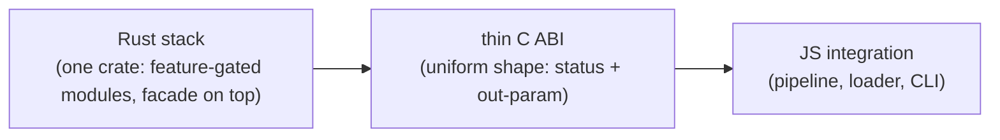

# bffi-rs - Design Document

[English](https://github.com/z2net/bffi-rs/blob/main/docs/DESIGN.md) | [Русский](https://github.com/z2net/bffi-rs/blob/main/docs/i18n/ru/DESIGN.md) | [简体中文](https://github.com/z2net/bffi-rs/blob/main/docs/i18n/zh-CN/DESIGN.md)

**Status:** Accepted  
**Date:** 2026-09-10  
**License:** MIT  
**Repository:** https://github.com/z2net/bffi-rs  
**Contact:** contact@z2net.com

---

## 1. Purpose

`bffi-rs` is a native-binding framework for **Bun only** - the `napi-rs` equivalent for the Bun runtime.

A native module is written in Rust, compiled to a `cdylib`, and consumed from TypeScript through `bun:ffi` and a thin C ABI. The framework does not depend on Node-API and is not compatible with Node.js or Deno; it is native to the Bun ecosystem by design.

## 2. Goals

- **Safety at the FFI boundary** - the boundary is where Rust's guarantees end; the framework puts explicit rules in its place.
- **Clear ownership** - every value crossing the boundary has one side responsible for it, expressed in the types.
- **Developer experience** - annotate, build, import typed functions; errors are diagnostics, not mysteries.
- **Long-term maintainability** - small modules, built bottom-up; deterministic artifacts that can be committed and diffed.
- **Bun-first** - no compromises for other runtimes.

## 3. Architecture overview

Three planes, connected by one contract:

**Rust side, bottom-up.** The published crate `bffi` contains the whole stack as feature-gated modules with the pre-merge names preserved (`bffi::bffi_core`, `bffi::bffi_types`, ...): `bffi-core` is the foundation (generational handles, the object registry, the boundary policy); above it `bffi-error` (the `BffiError` -> JS Error mapping), `bffi-types` (conversions, SIMD UTF-8, the shared wire codec), `bffi-object` (ObjectWrap), `bffi-callback` (two-direction callbacks and the generic callback ABI), `bffi-event-loop` (queue and drains), `bffi-async` (Rust futures as JS Promises), `bffi-dts` (descriptor IR and renderers), `bffi-build` (runtime ABI exports and the loader JSON). The separate proc-macro crate `bffi-macros` (physically unavoidable: a proc-macro cannot live inside a normal crate) provides `#[bffi]`, `#[bffi_async]` and the class macros, sharing internals in its `support`/`class` modules. The facade re-exports everything flat, plus the `core`/`types`/`dts`/`object`/`build`/`r#async` namespaces the macro expansions name by default. `bffi-native` is the reference cdylib.

**JS side.** `@z2net/bffi` (packages/bffi) is the config-driven pipeline - cargo build, loader JSON, generated TypeScript, dlopen - plus the typed runtime loader. `@z2net/bffi-cli` (packages/bffi-cli) is the `bffi` CLI: init, build, check, doctor, codegen, pack, fetch. `@z2net/bffi-native` (packages/native) is the published reference native module family.

**How an export travels.** Every annotated item produces two things at compile time: a thin C shim with one uniform ABI shape (status plus out-parameter) and a descriptor. The descriptors aggregate into a single module definition per crate; that aggregation is the complete machine-readable truth about the exports. Because the schema is complete, the JS side drives everything generically - symbol lookup, argument marshalling, result and error decoding - with no hand-written bindings.

## 4. Safety model

These are invariants, not implementation details:

| Invariant | Rationale |
| --- | --- |
| Copy by default across the boundary. | No shared lifetimes between two languages unless explicitly asked for. |
| Zero-copy only through `bffi::unsafe_zero_copy`. | A dangerous capability must be visible at the call site and never inferred. |
| Generational handles + type tags. | A stale or mistyped handle can never reach a reused slot or the wrong type. |
| Every `extern "C"` body runs under the boundary policy: bare in debug (for debuggability), `catch_unwind` in release. | The artifact is a cdylib loaded **into** the Bun process - an abort kills the host. Panics become JS errors in production and never cross as undefined behavior. |
| UTF-8 is the canonical boundary encoding. | One string contract; `bun:ffi` cstrings stay well-defined. |
| The public Rust API is 100% safe. | `unsafe` exists only inside the crates, behind reviewed doors. |
| Errors are values: `BffiError` = code + message + source; domain errors convert losslessly. | The JS side drains them into `Error` with `cause` - failures are structured, never silent. |
| Stable E-codes for macro diagnostics. | Macros must fail with readable, greppable errors, not token soup. |

## 5. Async & event loop model

JavaScript runs on exactly one thread. Three roles cooperate around it:

- **JS thread** - the only thread that executes JavaScript; it also drains the event loop.
- **Executor workers** - poll Rust futures; they never touch JavaScript.
- **Timer thread** - serves deadlines (sleep, timeouts); it never touches JavaScript either.

Task resolution and callback invocations that originate off the JS thread are **delivered, not executed**: they are enqueued and run on the JS thread while it drains. A call made from the wrong thread is rejected (marshalled through the queue), never smuggled onto JavaScript.

The drain is an **explicit contract**: the embedding code pumps (or runs the loop) when it chooses - typically on a documented periodic pattern. The framework never installs hidden timers or pumps implicitly. Cancellation is cooperative - a cancelled task is dropped at its next poll - and timeouts are first-class combinators. Tokio is an opt-in executor choice, not a requirement.

## 6. TypeScript & codegen model

**Descriptors are the single source of truth.** One aggregation per crate flows into a canonical, deterministic loader JSON (schema v1), from which a deterministic renderer produces the typed TypeScript module with exact types. Generated files are byte-stable: safe to commit, safe to diff.

There are no hand-written bindings. When descriptors and generated files disagree, `bffi check` fails - drift is a build error, not a runtime surprise.

## 7. Distribution model

Distribution is **platform npm packages**, napi-rs style:

- A base package declares one `optionalDependencies` entry per platform, **exact-pinned**; npm/bun installs only the entry matching the host.
- Every artifact follows one naming convention, and `resolvePlatformBinary` maps platform -> package -> binary path. `bffi pack` assembles a platform package from a built cdylib.
- Platform packages are published **first** (or together with) the base package; a partial matrix is visible at install time, not discovered at runtime.

Supported targets are seven 64-bit triples: `win32-x64-msvc`, `linux-x64-gnu`, `linux-x64-musl`, `linux-arm64-gnu`, `linux-arm64-musl`, `darwin-x64`, `darwin-aarch64`. There are no 32-bit targets.

## 8. Examples as executable specifications

Each example is a working module and an end-to-end test of one slice of the design:

- [examples/sqlite](https://github.com/z2net/bffi-rs/blob/main/examples/sqlite) - the full pipeline on a real workload.
- [examples/async](https://github.com/z2net/bffi-rs/blob/main/examples/async) - futures as Promises, cancellation, timeouts, the explicit pump.
- [examples/event-loop](https://github.com/z2net/bffi-rs/blob/main/examples/event-loop) - queue, drains, marshal.
- [examples/callbacks](https://github.com/z2net/bffi-rs/blob/main/examples/callbacks) - both directions, the JS-thread gate, marshal delivery.

## 9. Decisions log

Accepted decisions, one line each:

| Topic | Decision |
| --- | --- |
| Compatibility | Bun only; no Node.js / Deno layers. |
| Buffers | Copy by default; zero-copy only via `bffi::unsafe_zero_copy`. |
| Handles | Generational index + type tag (`u64`). |
| Panics | Convert to JS `Error` in release; abort allowed in debug only. |
| Boundary strings | UTF-8 canonical. |
| C ABI | Uniform shape: status + out-parameter, for every export. |
| Event loop | Explicit pump/run contract; deliveries execute on the JS thread. |
| TypeScript | Descriptors are the single source of truth; deterministic generation; schema v1. |
| Distribution | Platform npm packages over a monolithic binary; exact pins. |
| Toolchain | Bun >= 1.4.0 (enforced); Rust 1.98.0 (pinned). |
| Targets | 64-bit only (seven triples); no 32-bit for now. |
| Diagnostics | Stable E-codes for macro errors. |
| License | MIT. |

## 10. Non-goals

- Node.js or Deno compatibility.
- API compatibility with `napi-rs`.
- Hiding the FFI boundary behind magic - the boundary stays legible and explicit.
- Zero-copy as a default.
- 32-bit targets (for now).
- Maximum performance at any cost on day one.

## 11. Contact

- GitHub Issues / Discussions
- Email: **contact@z2net.com**
