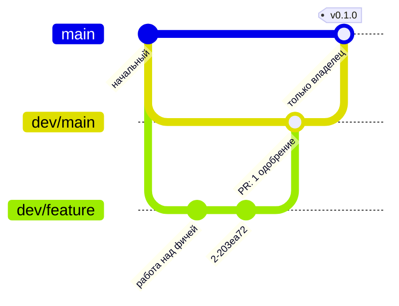

# Как внести вклад в bffi-rs

[English](https://github.com/z2net/bffi-rs/blob/main/docs/CONTRIBUTING.md) | **[Русский](https://github.com/z2net/bffi-rs/blob/main/docs/i18n/ru/CONTRIBUTING.md)** | [简体中文](https://github.com/z2net/bffi-rs/blob/main/docs/i18n/zh-CN/CONTRIBUTING.md)

Спасибо за ваш интерес к внесению вклада.

Репозиторий: https://github.com/z2net/bffi-rs
Контакт: contact@z2net.com

Пожалуйста, прочитайте также:

- [DESIGN.md](https://github.com/z2net/bffi-rs/blob/main/docs/i18n/ru/DESIGN.md) - архитектура и решения
- [AGENTS.md](https://github.com/z2net/bffi-rs/blob/main/docs/i18n/ru/AGENTS.md) - правила для людей и AI-агентов
- [CODE_OF_CONDUCT.md](https://github.com/z2net/bffi-rs/blob/main/docs/i18n/ru/CODE_OF_CONDUCT.md)

---

## Настройка окружения разработки

### Требования

- **Rust / Cargo 1.98.0** (зафиксирован)
- **Bun >= 1.4.2**
- Git

```bash
# Установка / выбор тулчейна Rust
rustup toolchain install 1.98.0
rustup default 1.98.0

# Клонирование
git clone https://github.com/z2net/bffi-rs.git
cd bffi-rs

# JS-инструментарий
bun install
```

### Полезные команды

```bash
bun run lint          # oxlint
bun run typecheck     # проверка TypeScript
bun run build         # собирает эталонную cdylib (release)
bun run test:js       # прогоняет юнит-тесты пакетов (bun test packages)
bun run ci            # полный CI-паритет: lint, typecheck, fmt, clippy, тесты, JS-тесты
cargo fmt
cargo clippy
cargo check
cargo test
```

---

## Конвенция сообщений коммитов

Мы следуем [Conventional Commits](https://www.conventionalcommits.org/).

Формат:

```
<type>(optional scope): <short description>

[optional body]

[optional footer]
```

### Допустимые типы

| Тип        | Значение                                       |
| ---------- | ---------------------------------------------- |
| `feat`     | Новая функциональность                         |
| `fix`      | Исправление бага                               |
| `docs`     | Только документация                            |
| `style`    | Форматирование, без изменения логики           |
| `refactor` | Изменение кода, не являющееся фиксом или фичей |
| `perf`     | Улучшение производительности                   |
| `test`     | Добавление или исправление тестов              |
| `build`    | Система сборки или зависимости                 |
| `ci`       | Конфигурация CI                                |
| `chore`    | Задачи сопровождения                           |
| `revert`   | Отмена предыдущего коммита                     |

### Примеры

```
feat(core): implement generational handle table
fix(types): correctly copy UTF-8 strings across FFI
docs: clarify zero-copy policy in DESIGN.md
refactor(macros): simplify #[bffi] expansion
chore: pin rust-toolchain to 1.98.0
```

Критические изменения (breaking changes):

```
feat(api)!: rename Handle to BffiHandle

BREAKING CHANGE: the public type `Handle` was renamed to `BffiHandle`.
```

---

## Ветвление и релизы

### Модель веток

| Ветка           | Назначение                                                                    |
| --------------- | ----------------------------------------------------------------------------- |
| `main`          | Продакшн-ветка. Только стабильный, готовый к релизу код.                      |
| `dev/main`      | Интеграционная ветка. Вся работа над фичами попадает сюда через пул-реквесты. |
| `dev/<feature>` | Ветки фич (`dev/ffi-handles`, `dev/error-mapping`, ...).                      |

- Пул-реквесты в `main` создаются **только владельцем проекта**, из `dev/main`.
- Вся разработка ведётся в ветках `dev/<feature>`, которые отпочковываются от `dev/main` и мержатся обратно в `dev/main`.
- Названия веток в kebab-case: `dev/ffi-handles`, `dev/fix-panic-mapping`.



### Правила ревью

- Пул-реквест `dev/<feature>` → `dev/main`: как минимум **1 одобрение** (владелец или мейнтейнер) и зелёный CI (workflow `ci.yml` в GitHub Actions; локально - `bun run ci`).
- Пул-реквест `dev/main` → `main`: только владелец, при релизном мерже (см. теги ниже).
- Ревью следует чек-листу из шаблона пул-реквеста (fmt, clippy, тесты, lint, документация).

### Теги

- Теги имеют вид `v<semver>` (например, `v0.1.0`) и создаются **только на `main`** и только владельцем.
- Теги **аннотированные** (`git tag -a v0.1.0 -m "..."`) и указывают на мерж-коммит `dev/main` → `main`.
- Версия в `Cargo.toml` / `package.json` повышается в том же релизном мерже; мерж-коммит имеет вид `chore(release): v0.1.0`.
- Пре-релизные теги (`v0.2.0-rc.1`) могут опционально ставиться на `dev/main` для промежуточных сборок.

---

## Пул-реквесты

1. Сделайте форк репозитория и создайте ветку от `dev/main`.
2. Внесите сфокусированное изменение (одна логическая единица на пул-реквест).
3. Убедитесь, что проходит `bun run ci` (lint, typecheck, fmt, clippy, тесты).
4. Заполните шаблон пул-реквеста.
5. Укажите связанные issues, если они есть.
6. Будьте готовы обсуждать проектные решения - нам важна долгосрочная согласованность с `DESIGN.md`.

### Заголовок PR

Предпочитайте тот же стиль Conventional Commits, что и в сообщениях коммитов.

---

## Issues

Используйте предоставленные шаблоны issues:

- **Сообщение о баге**
- **Запрос функциональности**
- **Вопрос по дизайну / архитектуре**

При сообщении о баге укажите:

- Версию Bun (`bun --version`)
- Версию Rust (`rustc --version`)
- ОС и архитектуру
- Минимальный пример для воспроизведения, если возможно

---

## Напоминания о безопасности и архитектуре

- Путь данных по умолчанию - **копирование**, а не zero-copy.
- Zero-copy только через `bffi::unsafe_zero_copy`.
- Дескрипторы (handles) - это индекс с поколением + тег типа.
- Никакого кода совместимости с Node.js / Deno.
- Не коммитьте секреты, папки личных AI-конфигураций (`.grok`, `.claude`, `.codex`, …) или файлы `.env`.

---

## Кодекс поведения

Будьте уважительны. См. [CODE_OF_CONDUCT.md](https://github.com/z2net/bffi-rs/blob/main/docs/i18n/ru/CODE_OF_CONDUCT.md).

Травля, токсичное поведение или недобросовестные вклады не допускаются.

---

## Лицензия

Внося вклад, вы соглашаетесь с тем, что ваши вклады лицензируются по лицензии **MIT**.

---

## Вопросы?

- Откройте GitHub Discussion или Issue
- Email: **contact@z2net.com**
