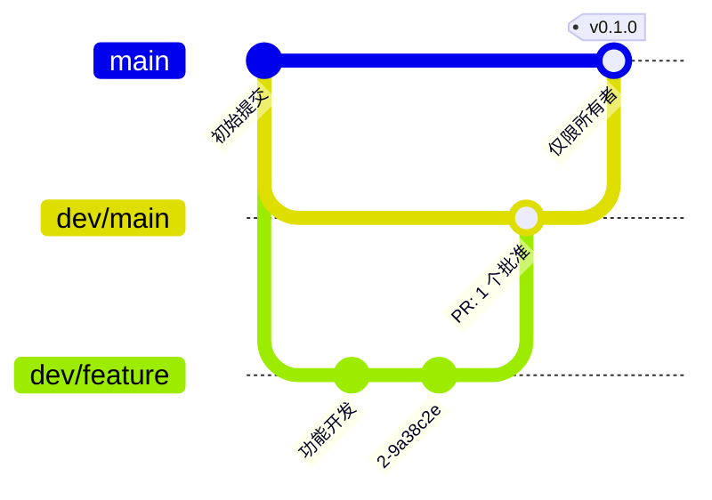

# 为 bffi-rs 做贡献

[English](https://github.com/z2net/bffi-rs/blob/main/docs/CONTRIBUTING.md) | [Русский](https://github.com/z2net/bffi-rs/blob/main/docs/i18n/ru/CONTRIBUTING.md) | **[简体中文](https://github.com/z2net/bffi-rs/blob/main/docs/i18n/zh-CN/CONTRIBUTING.md)**

感谢你有兴趣参与贡献。

仓库:https://github.com/z2net/bffi-rs
联系方式:contact@z2net.com

请同时阅读:

- [DESIGN.md](https://github.com/z2net/bffi-rs/blob/main/docs/i18n/zh-CN/DESIGN.md) - 架构与决策
- [AGENTS.md](https://github.com/z2net/bffi-rs/blob/main/docs/i18n/zh-CN/AGENTS.md) - 人类与 AI 代理的规则
- [CODE_OF_CONDUCT.md](https://github.com/z2net/bffi-rs/blob/main/docs/i18n/zh-CN/CODE_OF_CONDUCT.md)

---

## 开发环境搭建

### 要求

- **Rust / Cargo 1.98.0**(已锁定)
- **Bun >= 1.4.2**
- Git

```bash
# Install / select Rust toolchain
rustup toolchain install 1.98.0
rustup default 1.98.0

# Clone
git clone https://github.com/z2net/bffi-rs.git
cd bffi-rs

# JS tooling
bun install
```

### 常用命令

```bash
bun run lint          # oxlint
bun run typecheck     # TypeScript 检查
bun run build         # 构建参考 cdylib(release)
bun run test:js       # 运行包的单元测试(bun test packages)
bun run ci            # 完整 CI 等价:lint、typecheck、fmt、clippy、测试、JS 测试
cargo fmt
cargo clippy
cargo check
cargo test
```

---

## 提交信息约定

我们遵循 [Conventional Commits](https://www.conventionalcommits.org/)。

格式:

```
<type>(optional scope): <short description>

[optional body]

[optional footer]
```

### 允许的类型

| 类型       | 含义                         |
| ---------- | ---------------------------- |
| `feat`     | 新功能                       |
| `fix`      | 缺陷修复                     |
| `docs`     | 仅文档变更                   |
| `style`    | 格式调整,不改变逻辑          |
| `refactor` | 既非修复也非新功能的代码变更 |
| `perf`     | 性能改进                     |
| `test`     | 添加或修复测试               |
| `build`    | 构建系统或依赖项             |
| `ci`       | CI 配置                      |
| `chore`    | 维护任务                     |
| `revert`   | 回滚之前的提交               |

### 示例

```
feat(core): implement generational handle table
fix(types): correctly copy UTF-8 strings across FFI
docs: clarify zero-copy policy in DESIGN.md
refactor(macros): simplify #[bffi] expansion
chore: pin rust-toolchain to 1.98.0
```

破坏性变更:

```
feat(api)!: rename Handle to BffiHandle

BREAKING CHANGE: the public type `Handle` was renamed to `BffiHandle`.
```

---

## 分支与发布

### 分支模型

| 分支            | 用途                                                  |
| --------------- | ----------------------------------------------------- |
| `main`          | 生产分支。仅包含稳定、可发布的代码。                  |
| `dev/main`      | 集成分支。所有功能工作都通过 PR 汇入此处。            |
| `dev/<feature>` | 功能分支(`dev/ffi-handles`、`dev/error-mapping` 等)。 |

- 进入 `main` 的 PR **仅由项目所有者**从 `dev/main` 创建。
- 所有开发都在 `dev/<feature>` 分支上进行,这些分支从 `dev/main` 切出,并合并回 `dev/main`。
- 分支名采用 kebab-case:`dev/ffi-handles`、`dev/fix-panic-mapping`。



### 审查规则

- PR `dev/<feature>` → `dev/main`:至少需要 **1 个批准**(所有者或维护者)以及绿色 CI(GitHub Actions 的 `ci.yml` workflow;本地为 `bun run ci`)。
- PR `dev/main` → `main`:仅限所有者,在发布合并时进行(参见下方的标签)。
- 审查遵循 PR 模板中的检查清单(fmt、clippy、测试、lint、文档)。

### 标签

- 标签为 `v<semver>`(例如 `v0.1.0`),**仅由所有者创建在 `main` 上**。
- 标签是**附注标签**(`git tag -a v0.1.0 -m "..."`),指向 `dev/main` → `main` 的合并提交。
- `Cargo.toml` / `package.json` 中的版本号在同一次发布合并中提升;合并提交信息为 `chore(release): v0.1.0`。
- 预发布标签(`v0.2.0-rc.1`)可以按需放置在 `dev/main` 上,用于中间构建。

---

## 拉取请求

1. Fork 仓库,并从 `dev/main` 创建分支。
2. 做出聚焦的更改(每个 PR 只包含一个逻辑单元)。
3. 确保 `bun run ci` 通过(lint、typecheck、fmt、clippy、测试)。
4. 填写拉取请求模板。
5. 如有相关 issue,请进行关联。
6. 准备好讨论设计决策 - 我们重视与 `DESIGN.md` 的长期一致性。

### PR 标题

优先使用与提交信息相同的 Conventional Commits 风格。

---

## Issue

请使用提供的 issue 模板:

- **错误报告**
- **功能请求**
- **设计 / 架构问题**

报告 bug 时,请包含:

- Bun 版本(`bun --version`)
- Rust 版本(`rustc --version`)
- 操作系统与架构
- 如有可能,提供最小复现步骤

---

## 安全与架构提醒

- 默认数据路径是**复制**,而非零拷贝。
- 零拷贝仅能通过 `bffi::unsafe_zero_copy` 进行。
- 句柄采用 Generational Index + type-tag。
- 不包含任何 Node.js / Deno 兼容代码。
- 不要提交机密信息、个人 AI 配置文件夹(`.grok`、`.claude`、`.codex` 等)或 `.env` 文件。

---

## 行为准则

请保持尊重。参见 [CODE_OF_CONDUCT.md](https://github.com/z2net/bffi-rs/blob/main/docs/i18n/zh-CN/CODE_OF_CONDUCT.md)。

骚扰、恶意行为或不怀好意的贡献都不会被容忍。

---

## 许可证

参与贡献即表示你同意你的贡献按照 **MIT** 许可证进行授权。

---

## 有疑问?

- 打开 GitHub 讨论或 Issue
- 邮箱:**contact@z2net.com**
