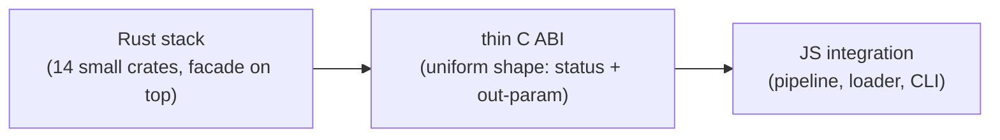

# bffi-rs - 设计文档

[English](https://github.com/z2net/bffi-rs/blob/main/docs/DESIGN.md) | [Русский](https://github.com/z2net/bffi-rs/blob/main/docs/i18n/ru/DESIGN.md) | **简体中文**

**状态:** 已接受  
**日期:** 2026-09-10  
**许可证:** MIT  
**仓库:** https://github.com/z2net/bffi-rs  
**联系方式:** contact@z2net.com

---

## 1. 目的

`bffi-rs` 是一个**仅面向 Bun** 的原生绑定框架 - 即 Bun 运行时的 `napi-rs` 等价物。

原生模块用 Rust 编写,编译为 `cdylib`,再由 TypeScript 通过 `bun:ffi` 与一层薄 C ABI 调用。本框架不依赖 Node-API,也不兼容 Node.js 或 Deno;它在设计上就原生属于 Bun 生态。

## 2. 目标

- **FFI 边界的安全** - 边界是 Rust 保证终结之处;框架以明确的规则取而代之。
- **清晰的所有权** - 每个跨越边界的值都有一方对其负责,并体现在类型之中。
- **开发者体验** - 加注解、构建、导入带类型的函数;错误是诊断信息,而非谜团。
- **长期可维护性** - 小型 crate、自底向上构建;产物具有确定性,可提交、可 diff。
- **Bun 优先** - 不为其他运行时妥协。

## 3. 架构总览

三个层面,由同一份契约连接:

**Rust 侧,自底向上。** `bffi-core` 是地基:世代句柄、对象注册表与边界策略。其上是各司其职的 crate - `bffi-error`、`bffi-types`(类型转换,外加共享的 wire 编解码)、`bffi-object`(ObjectWrap)、`bffi-callback`(双向回调与泛型回调 ABI)、`bffi-event-loop`(队列与排空)、`bffi-async`(把 Rust future 变成 JS Promise)、`bffi-dts`(描述符 IR 与渲染器)、`bffi-build`(运行时 ABI 导出与 loader JSON)。过程宏 crate - `bffi-macros`(`#[bffi]`、`#[bffi_async]`)与 `bffi-class`(`#[bffi_class]`) - 的内部实现放在 `bffi-macro-support` 中共享。`bffi` 是门面:一个依赖,再导出整个技术栈。`bffi-native` 是参考 cdylib。

**JS 侧。** `@z2net/bffi`(packages/bffi)是配置驱动的流水线 - cargo build、loader JSON、生成 TypeScript、dlopen - 外加类型化的运行时加载器。`@z2net/bffi-cli`(packages/bffi-cli)是 `bffi` CLI:init、build、check、doctor、codegen、pack、fetch。`@z2net/bffi-native`(packages/native)是已发布的参考原生模块家族。

**一个导出是如何流转的。** 每个被注解的条目在编译期产出两样东西:一个 ABI 形状统一(状态码 + out 参数)的薄 C 包装函数(shim),以及一个描述符。描述符按 crate 聚合成单一的模块定义;这份聚合就是关于导出的完整、机器可读的事实。正因为这份模式是完整的,JS 侧才能泛型地驱动一切 - 符号查找、参数编组、结果与错误解码 - 无需任何手写绑定。

## 4. 安全模型

以下是不变量,而非实现细节:

| 不变量 | 理由 |
| --- | --- |
| 跨边界默认复制。 | 除非明确要求,两种语言之间不共享生命周期。 |
| 零拷贝只能通过 `bffi::unsafe_zero_copy`。 | 危险能力必须在调用点一目了然,绝不能靠推断。 |
| 世代句柄 + 类型标签。 | 过期或类型不符的句柄,永远触达不了被复用的槽位或错误的类型。 |
| 每个 `extern "C"` 函数体都在边界策略下运行:debug 直接执行(便于调试),release 包上 `catch_unwind`。 | 构建产物是加载**进** Bun 进程的 cdylib - 一旦中止,宿主随之死亡。生产环境中 panic 转换为 JS 错误,绝不以未定义行为的形式跨界。 |
| UTF-8 是规范的边界编码。 | 一份字符串契约;`bun:ffi` 的 cstring 语义始终良定义。 |
| 公共 Rust API 100% 安全。 | `unsafe` 只存在于 crate 内部,藏在经过审查的门后。 |
| 错误即值:`BffiError` = 代码 + 消息 + 来源;领域错误可无损转换。 | JS 侧将其排空为带 `cause` 的 `Error` - 失败是结构化的,绝无静默。 |
| 宏诊断使用稳定的 E 编码。 | 宏必须以可读、可 grep 的错误失败,而不是一锅 token 浆糊。 |

## 5. 异步与事件循环模型

JavaScript 只运行在一个线程上。三个角色围绕它协作:

- **JS 线程** - 唯一执行 JavaScript 的线程;它同时负责排空事件循环。
- **执行器 worker** - 轮询 Rust future;它们绝不触碰 JavaScript。
- **定时器线程** - 负责各类截止时间(sleep、超时);它同样绝不触碰 JavaScript。

在 JS 线程之外产生的任务完成与回调调用,都是**被投递,而非被执行**:它们先入队,等 JS 线程排空时再在它上面运行。从错误线程发起的调用会被拒绝(经队列编组),绝不会被偷渡到 JavaScript 上。

排空是一份**显式契约**:嵌入方代码自行选择时机泵送(或运行循环)- 通常遵循文档写明的周期性模式。框架从不安装隐藏的定时器,也从不隐式泵送。取消是协作式的 - 被取消的任务在下一次 poll 时被 drop - 超时则是一等公民的组合器。Tokio 是可选的执行器选择,并非必需。

## 6. TypeScript 与代码生成模型

**描述符是唯一事实来源。** 每个 crate 的聚合结果汇入一份规范、确定性的 loader JSON(schema v1),确定性渲染器再从中产出带精确类型的 TypeScript 模块。生成文件逐字节稳定:可放心提交,可放心 diff。

这里没有任何手写绑定。当描述符与生成文件不一致时,`bffi check` 直接失败 - 漂移是构建错误,而不是运行时的意外。

## 7. 分发模型

分发采用**平台 npm 包**,napi-rs 风格:

- 基础包为每个平台声明一条 `optionalDependencies` 条目,**精确锁版本**;npm/bun 只安装与主机匹配的那一条。
- 所有产物遵循同一套命名约定,`resolvePlatformBinary` 完成平台 -> 包 -> 二进制路径的映射。`bffi pack` 从构建好的 cdylib 组装出平台包。
- 平台包**先于**基础包发布(或与之同时);残缺的平台矩阵在安装时即可见,而不是到运行时才被发现。

支持的目标是七个 64 位三元组:`win32-x64-msvc`、`linux-x64-gnu`、`linux-x64-musl`、`linux-arm64-gnu`、`linux-arm64-musl`、`darwin-x64`、`darwin-aarch64`。没有 32 位目标。

## 8. 作为可执行规范的示例

示例模块位于独立仓库
[bffi-examples](https://github.com/z2net/bffi-examples);每个示例
在那里都是独立的 crate,同时也是对设计中一个切片的端到端测试:

- [sqlite](https://github.com/z2net/bffi-examples/tree/main/sqlite) - 在真实负载上跑通完整流水线。
- [async](https://github.com/z2net/bffi-examples/tree/main/async) - future 变 Promise、取消、超时、显式泵送。
- [event-loop](https://github.com/z2net/bffi-examples/tree/main/event-loop) - 队列、排空、marshal。
- [callbacks](https://github.com/z2net/bffi-examples/tree/main/callbacks) - 双向回调、JS 线程闸门、经编组投递。
- [records](https://github.com/z2net/bffi-examples/tree/main/records) - 复合类型矩阵:record、enum、序列、`Option` 字段与返回值。
- [streams](https://github.com/z2net/bffi-examples/tree/main/streams) - pull 与 push 生产者、背压、`Result` 项、wake 驱动投递。
- [errors](https://github.com/z2net/bffi-examples/tree/main/errors) - `#[derive(BffiError)]`:用户码、`e.name` / `e.payload`。
- [wry](https://github.com/z2net/bffi-examples/tree/main/wry) - 由 Bun 驱动的 webview 窗口(GUI 绑定参考;见 [docs/BINDING-GUI.md](https://github.com/z2net/bffi-rs/blob/main/docs/BINDING-GUI.md))。

## 9. 决策日志

已接受的决策,每条一行:

| 主题 | 决策 |
| --- | --- |
| 兼容性 | 仅 Bun;没有 Node.js / Deno 层。 |
| 缓冲区 | 默认复制;零拷贝仅经 `bffi::unsafe_zero_copy`。 |
| 句柄 | 世代索引 + 类型标签(`u64`)。 |
| Panic | release 中转换为 JS `Error`;仅 debug 允许中止。 |
| 边界字符串 | UTF-8 为规范编码。 |
| C ABI | 形状统一:状态码 + out 参数,适用于每一个导出。 |
| 事件循环 | 显式 pump/run 契约;投递在 JS 线程上执行。 |
| TypeScript | 描述符是唯一事实来源;确定性生成;schema v1。 |
| 分发 | 平台 npm 包,而非单体二进制;精确锁版本。 |
| 工具链 | Bun >= 1.4.0(强制);Rust 1.98.0(锁定)。 |
| 目标平台 | 仅 64 位(七个三元组);暂无 32 位。 |
| 诊断 | 宏错误使用稳定的 E 编码。 |
| 许可证 | MIT。 |

## 10. 非目标

- 与 Node.js 或 Deno 的兼容性。
- 与 `napi-rs` 的 API 兼容。
- 用魔法掩盖 FFI 边界 - 边界保持清晰、显式。
- 把零拷贝当作默认。
- 32 位目标(暂时)。
- 第一天就不惜一切代价追求极致性能。

## 11. 联系方式

- GitHub Issues / Discussions
- 邮箱:**contact@z2net.com**
